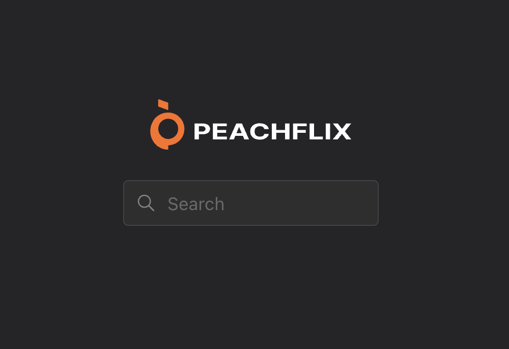
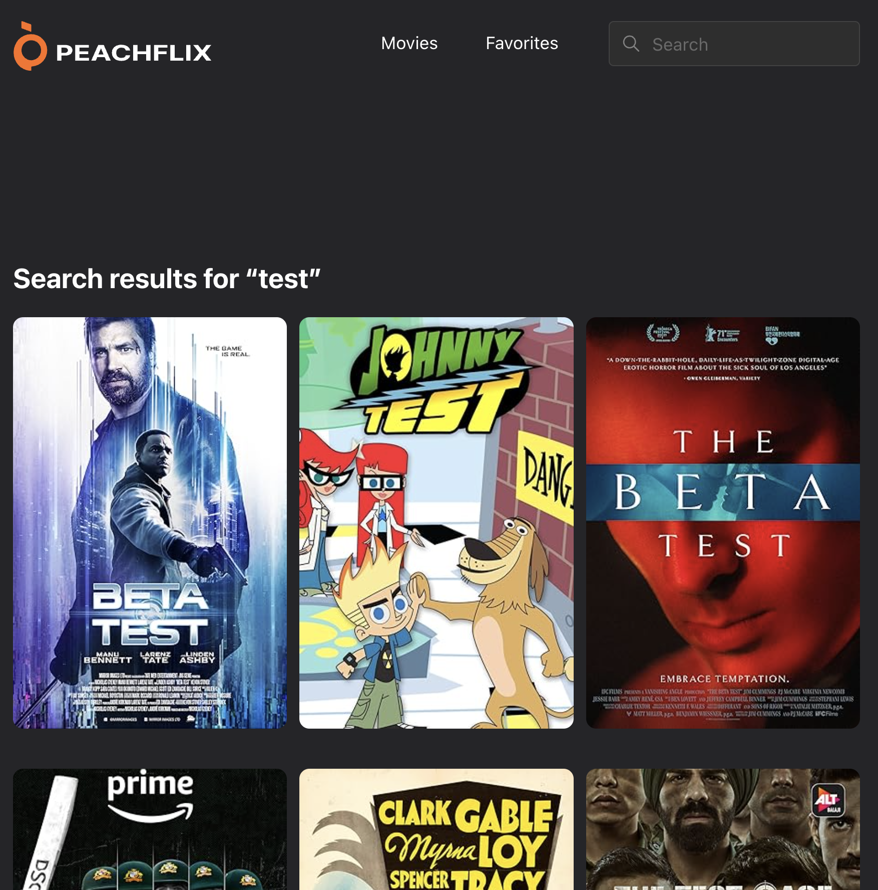
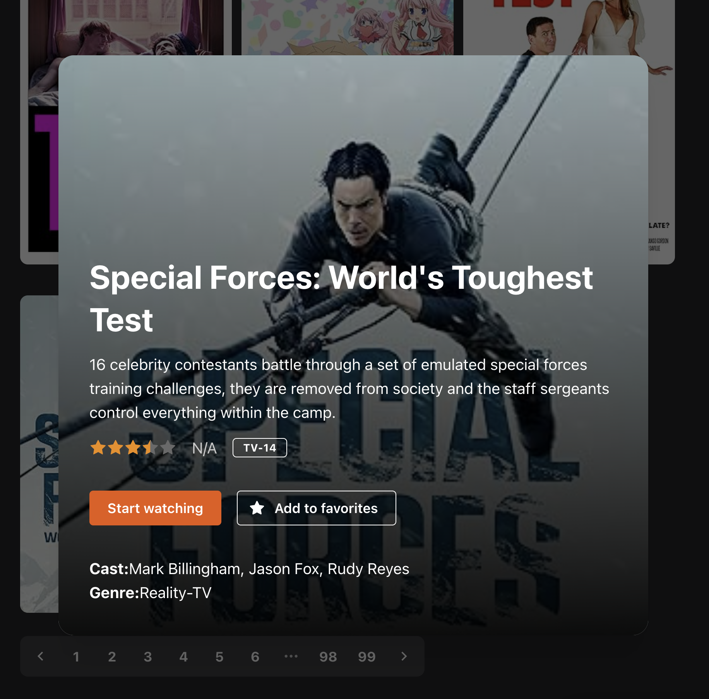
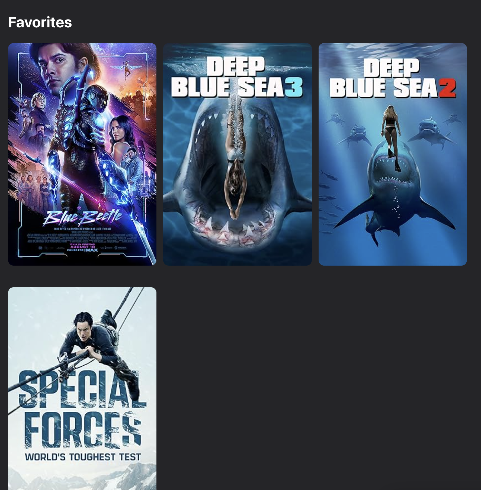

# Peach Frontend Challenge

### Running the Project

1. `npm install`
2. `npm run dev`

Click the link in the console to open the webpage.

## Notes

### Overview






This is a React single page web app implementing the Peachflix design and user stories.

- Full Tech Stack
  - TypeScript, React, Vite, React Query, Zustand, Mantine UI, React Router
  - I created a public web app template to get started on this at github.com/jasonpang/web-app-template

### Technical Choices

- Separating network state from business logic state

  - I used React Query's network store separately from Zustand's client store. Data and network status for API calls are stored in React Query. Other non-network client state is stored in Zustand (this turned out just to be favorite movie IDs).

- Transforming Network Responses: Capital fields to camelCase
  - The OMDB API returns fields in PascalCase. I added a transformation layer when selecting responses in React Query to convert these to lower case. This layer can have some benefits, for example if the backend changes something, we only need to change our translation layer. But it might be too much for a small project.
- Persist Middleware for Client State
  - By persisting the client state using Zustand's persist() middleware, implementing adding and removing favorited movies becomes as simple as saving the movie IDs in the store.
- Immer Middleware for Client State
  - Like the persist middleware above, this comes almost for free (just one import) and it makes it easier to update state without immutable spread patterns.
- Using CSS variables for maintainability

  - Tried to keep Peach styles as CSS variables for maintainability

  ```
  :root {
  --search-page-margin-top: 20vh;
  --movie-card-width: 200px;
  --color-grey-400: #a3a3a5;
  --color-grey-800: #3e3e40;
  --color-grey-700: #565659;
  --color-grey-900: #252528;
  }
  ```

  As I ran out of time, there are some places I hardcoded some hex values.

- CSS Modules
  - Using CSS modules, scoped to React components vs. global CSS
- UI Layout Components
  - To help speed things up, I used Mantine UI's helper React components instead of doing everything in CSS. For example, `<Group>` is similar to a Flex div with row flex direction, and `<Stack>` is similar to a Flex div with column flex direction. One other helper component Mantine UI exposes is <Center>.
- Control Flow for Movie Modal

  - For speed and simplicity, I had the `<MovieCard>` component control showing the `<MovieDetailModal>`.

  It would be better if `<MovieCard>` and `<MovieDetailModal>` were separated and independent from each other, even if it takes a little more code to trigger the modal from the parents.

### Design Choices

- Added a Fallback Image

  - Added a quick fallback image for movie posters.

- Content Top Margin

  - The Figma design shows the landing search page has a 200px-ish top margin and the search results and favorites page share this margin. I thought this is a lot of space but I kept it as `margin-top: 20vh`.

- Search Cleared After Submission

  - The Figma shows the search bar retains the value after submission, but I opted to clear it because it feels like a more standard practice. Definitely something I'd quickly ask about in a real project.

- Darker Search Input on Focus/Active
  - I saw the Figma has the search input gray when inactive and a much darker gray (almost black) when active/focused.

### Product Choices

- It was ambiguous what the "Movies" navbar link did. I don't know if it should be returning all movies without search, or if it should go back to the home page.

  I figured if we want to display all movies, it would be part of a user story. So I did the easier option and made the link go back to the search landing page.

### With more time...

- Handle "N/A"
  - OMDB API returns "N/A" instead of null. I don't check for this so N/A is displayed. I would add a check to make sure fields aren't displayed if N/A is the value.
- Display title if movie poster is not available
  - User can't tell what movie they're clicking into if the movie poster isn't available. Perhaps we can display the title.
- Testing
  - I'd add React Testing Library tests and maybe some Playwright end to end tests
- Refactoring
  - Some UI components have a lot of lines of code. I'd like to split them up further to be more bite-sized
- Hook Naming
  - Some hook names are confusing (useFavoriteMovie vs. useFavoriteMovies vs. useGetFavoriteMovies). I'd rethink/rename these if I had more time.
- Route Constants
  - It felt a little brittle to hardcode "/search" or "/favorites"
- Layout Responsiveness
- Better and more granular error handling and loading states
- Click logo to go home
